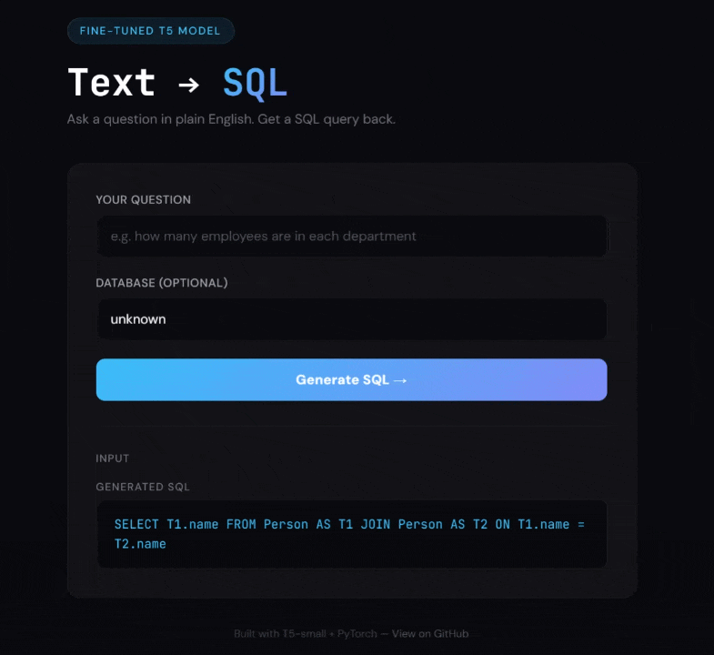

# Text → SQL 

I fine-tuned T5-small on the Spider dataset to turn plain English questions into SQL queries. Built the whole thing from scratch — PyTorch training loop, evaluation pipeline, and a Flask web demo.

Inspired by [Chat2DB](https://github.com/codePhiliaX/Chat2DB).



---

## Results

Started at **4.26%** exact match accuracy. After adding schema context, normalizing evaluation, and beam search — got it up to **9.38%**.

| What I Did | Accuracy | Correct |
|------------|----------|---------|
| Baseline | 4.26% | 44/1034 |
| + Schema-aware input | 4.45% | 46/1034 |
| + Normalized eval | 8.80% | 91/1034 |
| + Beam search (n=5) | **9.38%** | **97/1034** |

Training loss across 3 epochs: **1.14 → 0.56 → 0.41**

> Honestly a lot of the "wrong" predictions are functionally correct SQL — the exact match metric is strict and punishes stuff like quote style (`"france"` vs `'france'`) and extra whitespace.

---

## Example Outputs

```
❯ python predict.py --question "how many employees are in each department"
SQL: SELECT count(*), dept_code FROM employees GROUP BY dept_code  ✓

❯ python predict.py --question "show the names of students with a grade greater than 90"
SQL: SELECT T1.name FROM student AS T1 JOIN grade AS T2 ON T1.grade = T2.grade WHERE T2.grade > 90

❯ python predict.py --question "find all customers who spent over 100"
SQL: SELECT DISTINCT customer_id FROM customers WHERE avg(*) > 100
```

Not perfect — but the model gets the structure right most of the time. `avg(*)` isn't valid SQL but it understood the intent. T5-small is only 60M parameters so this is expected.

---

## How It Works

```
English question → prefix + db context → tokenize → T5 generates SQL → decode → done
```

- **Model:** Google's T5-small — encoder-decoder transformer, good for generation tasks
- **Dataset:** Spider by Yale — 7000+ question/SQL pairs across 200 databases
- **Training:** 3 epochs, AdamW optimizer, lr=3e-4, batch size 8
- **Inference:** Beam search with 5 beams

### Why T5 and not BERT?
BERT is encoder-only — great for classification stuff like sentiment analysis. T5 is encoder-decoder — built for generation. Text-to-SQL is a generation task so T5 is the right call.

---

## Run It Yourself

```bash
git clone https://github.com/YOUR_USERNAME/text-to-sql.git
cd text-to-sql
pip install -r requirements.txt
```

### Train the model
```bash
python train.py
```
Takes about 20 min on CPU. Model saves to `models/t5-sql/`.

### Run predictions
```bash
python predict.py --question "how many singers do we have" --db concert_singer
```

### Evaluate on test set
```bash
python predict.py --evaluate
```

### Launch the web demo
```bash
python app.py
```
Then hit `http://127.0.0.1:5000`

---

## Project Structure

```
text-to-sql/
├── train.py          ← training loop + fine-tuning
├── predict.py        ← inference + evaluation
├── app.py            ← Flask web demo
├── models/           ← saved model weights
├── requirements.txt  ← dependencies
└── README.md         ← you are here
```

---

## What I Learned

- **Fine-tuning** = taking a pre-trained model and training it further on your specific task. Way faster than training from scratch
- **Training loop** = zero_grad → forward → loss → backward → step. That's it. That's the whole thing
- **Exact match is harsh** — the model outputs valid SQL that gets marked wrong because of spacing/quotes
- **Schema context matters** — real Text-to-SQL systems feed table/column names into the model, not just the question
- **Beam search helps** — considering multiple candidates instead of just one improved accuracy for free

---

## Stack

PyTorch · HuggingFace Transformers · HuggingFace Datasets · Flask · scikit-learn

## Resources

- [Chat2DB](https://github.com/codePhiliaX/Chat2DB) — the project that inspired this
- [Spider Dataset](https://arxiv.org/abs/1809.08887) — Yale's Text-to-SQL benchmark
- [T5 Paper](https://arxiv.org/abs/1910.10683) — Google's text-to-text transformer
